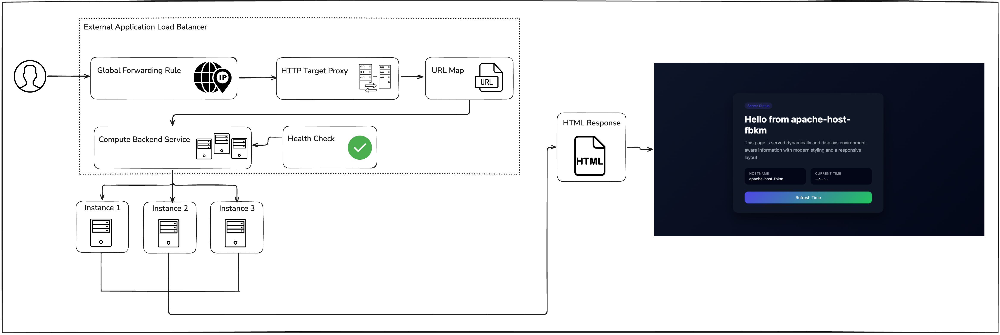

# GCP Terraform High-Availability Apache Infrastructure

This Terraform project deploys a **highly available, load-balanced Apache web server infrastructure** on Google Cloud Platform (GCP).

## Architecture diagram

<p align="center">
  
</p>


## Project Structure

```
.
├── main.tf                 # Root module configuration
├── variables.tf            # Variable definitions
├── output.tf              # Output values
├── provider.tf            # GCP provider configuration
├── terraform.tfvars       # Variable values
├── modules/
│   ├── compute/           # Instance template and managed group
│   │   ├── main.tf
│   │   ├── variables.tf
│   │   ├── output.tf
│   │   └── scripts/
│   │       ├── apache-startup.sh   # Startup script for golden image
│   │       └── apache-index.sh     # Startup script for instances
│   ├── network/           # VPC, subnet, and firewall
│   │   ├── mian.tf
│   │   ├── variables.tf
│   │   └── output.tf
│   └── loadbalancer/      # Load balancer and health checks
│       ├── main.tf
│       ├── variables.tf
│       └── output.tf
└── README.md
```


## Project Overview

The infrastructure consists of several modules:

- **Network Module** - Custom VPC with subnet and firewall rules
- **Compute Module** - Instance template, golden image, and managed instance group
- **Load Balancer Module** - Global HTTP load balancer with health checks

### Modules' components

#### Network (`./modules/network`)
- Custom VPC network (`tf-vpc-bm`)
- Subnet in `us-central1` region
- Firewall rules allowing:
  - Port 80 (HTTP) from user IP ranges
  - Health check traffic from Google Cloud IPs (130.211.0.0/22, 35.191.0.0/16)

#### Compute (`./modules/compute`)
- **Golden Image**: Custom Ubuntu 24.04 LTS image with Apache pre-installed
- **Instance Template**: Defines VM configuration (e2-medium, 80GB disk, Apache startup script)
- **Managed Instance Group**: 3 instances across multiple zones for redundancy
- **Named Port**: Port 80 labeled as "http-port" for load balancer routing

#### Load Balancer (`./modules/loadbalancer`)
- **Global Forwarding Rule**: Routes port 80 traffic to the backend
- **HTTP Proxy**: Handles HTTP requests
- **URL Map**: Routes traffic to the backend service
- **Backend Service**: Distributes traffic across the instance group
- **Health Check**: Monitors instance health (port 80, 10s intervals)
- **Static IP**: Reserved external IP address for consistent access

## Prerequisites

- GCP project with Compute Engine API enabled
- Terraform >= 1.0
- `gcloud` CLI configured with appropriate credentials
- SSH key for instance access (optional)

## Configuration

### Variables (`terraform.tfvars`)

```hcl
project     = "your-gcp-project-id"
region      = "us-central1"
zone        = "us-central1-a"
my_ip_allow = ["YOUR_IP_RANGE/XX"]  # e.g., ["209.0.0.0/8"]
```

## Deployment

1. **Initialize Terraform**:
   ```bash
   terraform init
   ```

2. **Plan the deployment**:
   ```bash
   terraform plan
   ```

3. **Apply the configuration**:
   ```bash
   terraform apply
   ```

4. **Get the load balancer IP**:
   ```bash
   terraform output
   ```

5. **To destroy all resources**:
    ```bash
    terraform destroy
    ```

## Key Features

✅ **High Availability**: 3 instances across multiple zones  
✅ **Auto-Healing**: Managed instance group replaces unhealthy instances  
✅ **Health Checks**: Continuous monitoring of instance health  
✅ **Load Balancing**: Global HTTP load balancer with CDN enabled  
✅ **Custom Image**: Golden image with Apache pre-installed for faster boot  
✅ **Security**: Firewall rules restrict access to authorized sources  


## Notes

- The golden image creation process requires the `instance_for_image` VM to be created and terminated
- Health check intervals are set to 10 seconds with 2 healthy/3 unhealthy thresholds
- CDN is enabled on the backend service for improved performance
- Instances use ephemeral external IPs (can be disabled if not needed)
